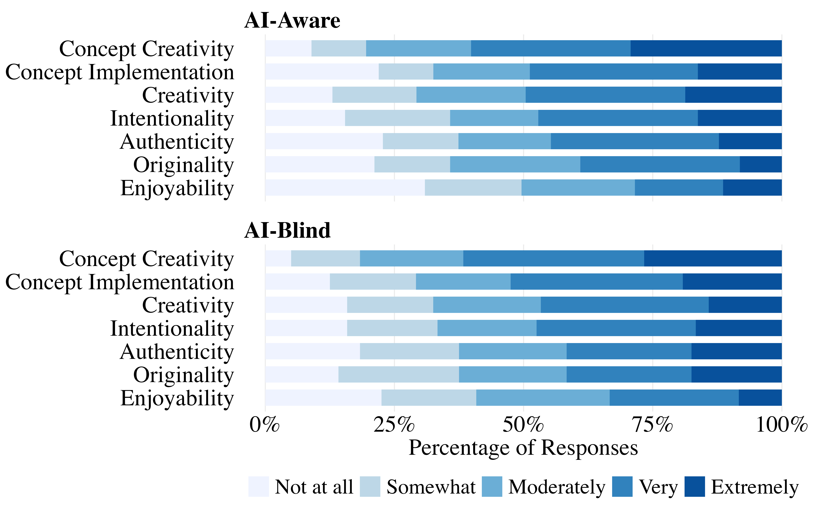

# Are Large Language Models Creative?

This repository contains the text, code, LLM conversation transcripts, and evaluation data for my Cognitive Science senior thesis at Vassar College. The project investigates the conceptual boundaries of creativity in LLMs and, consequentially, humans. Empirically, it tests whether frontier LLMs can autonomously generate perceptually creative video games as judged by avid gamers.

### Live Project Outputs
### Live Project Outputs
* **[View the 7-Stage LLM Generation Pipeline](https://javassar.github.io/thesis/games/workflow_demo.html)**
> A detailed walkthrough of the autonomous prompt architecture that directed Claude, ChatGPT, and Gemini to iteratively conceptualize, implement, and debug functional video games using the Phaser framework.
* **[View the Game Evaluation Experiment](https://javassar.github.io/thesis/experiment/evaluation.html)**
> This is the live jsPsych experimental environment where participants played and evaluated the AI-generated video games.
* **[Play the AI-Generated Game Library](https://javassar.github.io/thesis/library)**
> The complete collection of the 18 playable 2D video games generated by the LLMs during this study. Human involvement was as minimal as possible to maximize assessment of creativity independent from human influence.
* **[View the Written Thesis](https://javassar.github.io/thesis/Adelmann_Thesis.pdf)**
> The complete 115-page theoretical and empirical investigation. This text explores the conceptual boundaries of LLM creativity, detailing the rationale for the multi-modal generation domain, the mixed-methods analytical approach, and the final results.
---

### Part I: Theoretical Framework
The theoretical component of the thesis performs a multi-disciplinary exploration of the core tensions in attributing creativity to LLMs, including discussion of the LLM architecture. Some of these tensions are the prompt influence problem, the tool-agent spectrum, and the roles of intentionality, authenticity, and lived experience.

### Part II: The 7-Stage LLM Generation Pipeline
To empirically test LLM creativity in a functionally constrained, multi-modal domain, an autonomous game development workflow was architected:
* **Iterative Prompt Architecture:** Engineered a 7-stage iterative prompt pipeline to mimic iterative human idea generation, evaluation, implementation, and refinement.
* **Multi-Model Deployment:** Utilized three proprietary LLMs with their respective coding agents (GPT-5.2 Pro/Codex CLI, Claude Opus 4.6/Claude Code, and Gemini 3 Pro/Gemini CLI) to autonomously design and implement [18 functional JavaScript video games](https://javassar.github.io/thesis/library) using the Phaser framework.
* **LLM Self-Correction:** The pipeline prompted the models to evaluate their own game concepts, simulate the experience of a first-time player, and programmatically debug playability issues.

### Part III: Human-in-the-Loop Evaluation
To evaluate the success of the generation pipeline, a rigorous mixed-methods study was conducted to map how humans attribute creativity to machines:
* **Experimental Design:** Designed and deployed a [custom online experiment](https://javassar.github.io/thesis/experiment/evaluation.html) using the jsPsych framework to host the generated games.
* **Domain-Familiar Sample:** Conducted a controlled study with 81 domain-familiar participants (avid video game players) recruited via Prolific.
* **Consensual Assessment Technique:** Employed a modified, mixed-methods Consensual Assessment Technique (CAT) to evaluate the games across dimensions of originality, enjoyability, authenticity, and intentionality.
* **Authorship Manipulation:** Manipulated AI authorship awareness (AI-blind vs. AI-aware conditions) to measure the impact of producer schemas on the cultural attribution of creativity.
* **Concept vs. Execution Ratings:** Captured independent evaluations for both the abstract game concepts and the final playable implementations, isolating whether human judges attribute creativity to the initial idea or the functional execution.
* **Baseline Calibration:** Measured and statistically adjusted for participants' pre-existing attitudes toward AI and baseline gaming habits to rigorously isolate the true effect of the experimental manipulation.
* **Analytical Approach:** Harnessed ICC(2,k) reliability estimates, linear mixed-effects models, principal component analysis (PCA), and inductive thematic analysis to comprehensively assess the quantitative trends and qualitative drivers of how humans evaluate machine creativity.

#### Example Result: Distribution of Absolute Likert Ratings

> *Figure: Distribution of participant Likert evaluations of video games and their concepts across core creative dimensions, illustrating how domain-familiar judges evaluate autonomous LLM execution. Linear mixed-effects models found no significant differences between authorship-aware and authorship-blind participants' assessments.*

### Repository Structure
* **`Adelmann_Thesis.pdf`:** The final, complete text of the 115-page senior thesis.
* **`/analysis`:** Contains the R scripts and raw data for the linear mixed-effects models, principal component analysis (PCA), and inductive thematic analysis.
* **`/experiment`:** Contains the jsPsych framework code used to host the 18 video games and administer the evaluation surveys.
* **`/games`:** Contains the implementation files for the playable 2D video games generated during the study.
* **`.github/workflows` and others:** Project configuration and GitHub Pages deployment logic.

*(Note: The LLM conversation transcripts and intermediate design outputs are located within the respective game directories.)*

### Research Context
This thesis was submitted in partial fulfillment of the requirements for the major in Cognitive Science at Vassar College, under the advisement of Professor Joshua de Leeuw and Professor Stephen Flusberg.